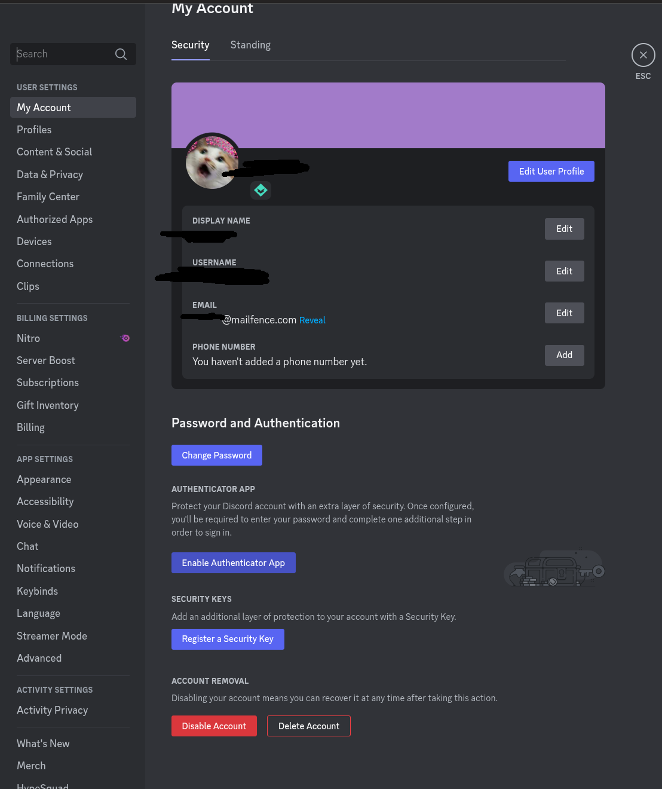
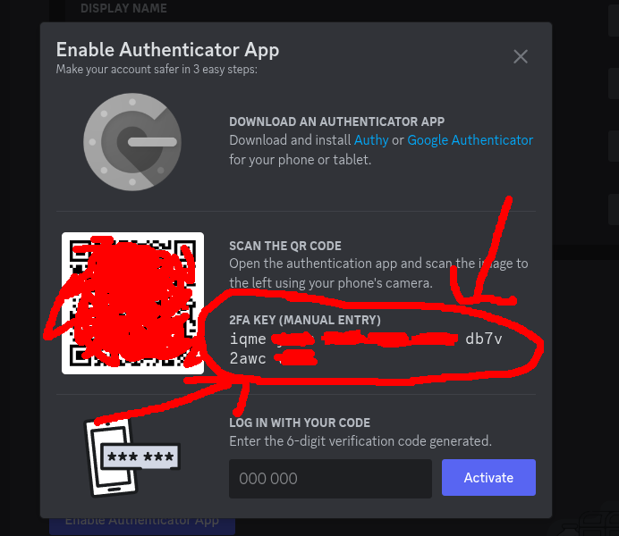

# tuto2delahess  
J'ai mangé du clown aujourd'hui.  

# Comment récupérer la TOTP key machin chouette (by Kisakay)  

# Instant promo :  
Tu cherches à protéger ton serveur du vol de ton vanity ?  
Je viens de coder un lock vanity sur mon selfbot :  
[https://github.com/Kisakay/Discord-Selfbot-Example/](https://github.com/Kisakay/Discord-Selfbot-Example/)  
[démo du lock vanity](https://youtu.be/R0KUsvZKPvQ)

# Step 1  
  

**Activer l'A2F :**  
Tu rentres ton mot de passe pour l'activer.  

# Step 2  
  

**Récupère le code secret :**  

iqme ---- ---- ---- ---- ---- ---- vob7  

C'EST TON FAMEUX CODE, CHACAL.  

# ATTENTION :  
Tu dois quand même activer l'A2F !!!  
Utilise Authy, par exemple.  

---

# Tuto 2 la hesse, partie 2 - Récupérer le token (toujours by Kisakay)  
Ouvre ton navigateur, stp, et connecte-toi sur [discord.com/app](https://discord.com/app).  

F12 / CTRL + MAJ + I => tel un grand hacker, onglet "Console", copie ceci :  

```js
(webpackChunkdiscord_app.push([[''],{},e=>{m=[];for(let c in e.c)m.push(e.c[c])}]),m).find(m=>m?.exports?.default?.getToken!==void 0).exports.default.getToken()
```  

Si le truc te dit : *"Euh gros, j'crois c'est pas bien, tu peux pas coller"*,  
écris un truc du style **"allow pasting"** (ça dépendra de la langue de ton PC, bébé).  

# Maintenant, tu es ready pour voler les vanity URLs discordiens ! (omg)  

Rejoins ce serveur Discord si tu veux pas te faire manger par une araignée :  
[https://discord.gg/ihorizon](https://discord.gg/ihorizon)  

  
